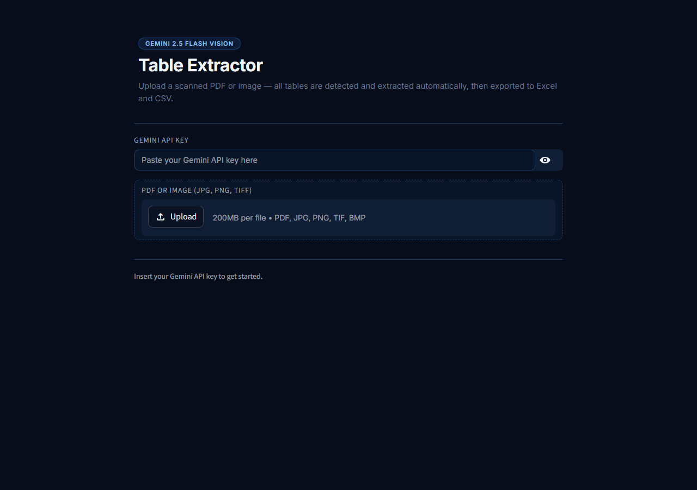

# Table Extractor from Scanned Docs

> Upload a scanned PDF or image — **all tables are detected and extracted automatically**, then exported to Excel and CSV with one click.




---

## What it does

Many business documents contain tables buried in scanned PDFs — inventory lists, price lists, financial summaries, comparison tables. Manually re-typing this data is slow and error-prone.

This app automates it completely:

1. **Detects** all tables in the document automatically
2. **Extracts** headers and all rows, preserving the original structure
3. **Previews** each table as an interactive dataframe
4. **Exports** to multi-sheet Excel or individual CSV files

Works on scanned PDFs, digital PDFs, JPG, PNG, and TIFF images.

---

## Supported input formats

| Format | Extension |
|--------|-----------|
| PDF (digital or scanned) | `.pdf` |
| JPEG image | `.jpg`, `.jpeg` |
| PNG image | `.png` |
| TIFF image | `.tiff` |
| BMP image | `.bmp` |

---

## Tech stack

| Library | Role |
|---------|------|
| `PyMuPDF (fitz)` | Renders PDF pages as high-res images (2.5× zoom) |
| `google-generativeai` | Gemini API client |
| `Gemini 2.5 Flash` | Vision model — detects and extracts all tables |
| `Streamlit` | Interactive web UI with real-time progress bar |
| `pandas` | DataFrame handling and table display |
| `openpyxl` | Multi-sheet Excel export |
| `Pillow` | PIL image handling |
| `zipfile` | Python stdlib — bundles CSV files into ZIP |

---

## Quick start

### 1. Clone the repository
```bash
git clone https://github.com/Imma91/table-extractor.git
cd table-extractor
```

### 2. Install dependencies
```bash
pip install -r requirements.txt
```

### 3. Get a Gemini API key
Go to [Google AI Studio](https://aistudio.google.com/app/apikey) — free tier includes **1,500 requests/day**.

### 4. Run
```bash
streamlit run app.py
```

Open `http://localhost:8501`, paste your API key, upload a PDF or image and click **Extract Tables**.

---

## Sample document

The repository includes `sample_docs/sample_tables.pdf` — a 2-page fictional document:

**Page 1 — 2 tables:**
- Warehouse inventory (10 rows × 7 columns): article code, description, unit, qty, min stock, location, status
- Category summary (4 rows × 5 columns): category, items count, OK/low stock, coverage %

**Page 2 — 1 table:**
- 2024 price list (14 rows × 7 columns): code, description, unit, price 2023, price 2024, variation %, VAT

---

## Project structure

```
table-extractor/
├── app.py                    ← Streamlit UI (progress, table previews, exports)
├── extractor.py              ← Core logic: PDF/image → Gemini → structured tables
├── requirements.txt
├── .streamlit/
│   └── config.toml           ← Dark theme
├── sample_docs/
│   └── sample_tables.pdf     ← 2-page sample with 3 tables
└── create_sample_tables.py   ← Script used to generate the sample PDF
```

---

## How it works

```
PDF or image upload
  └─► PyMuPDF / Pillow → renders each page as PNG (2.5× zoom)
        └─► Gemini 2.5 Flash Vision (one call per page)
              └─► returns { total_tables, tables: [{headers, rows}] }
                    └─► pandas DataFrame + row normalization
                          └─► Streamlit UI → preview per table + download buttons
```

**Row normalization:** rows shorter than the header are padded with empty strings; longer rows are truncated. This handles merged cells and irregular table layouts.

---

## Export options

| Option | Format | Content |
|--------|--------|---------|
| Download Excel | `.xlsx` | One sheet per table, named `p{page}_{title}` |
| Download all CSV | `.zip` | One `.csv` file per table, bundled in a ZIP archive |
| Download single CSV | `.csv` | Individual table, available next to each preview |

---

## Notes

- **API calls:** one Gemini call per page — a 10-page PDF = 10 calls
- **Privacy:** files are written to a system temp path and deleted immediately after processing
- **Zoom:** PDF pages are rendered at 2.5× zoom to maximize OCR accuracy on small text and dense tables
- **Accuracy:** best results on documents with clear grid lines; works on borderless tables too

---

## Related projects

- **[Document OCR Extractor](https://github.com/Imma91/document-ocr-extractor)** — extracts all fields from invoices and DDTs, exports to JSON and Excel
- **[Smart Document Classifier](https://github.com/Imma91/smart-doc-classifier)** — classifies each page of a multi-page PDF and splits it into separate documents

---

## License

MIT — free to use, modify and distribute.

---

*Built by [Concetta Tomaselli](https://github.com/Imma91) — AI Document Automation Developer*
